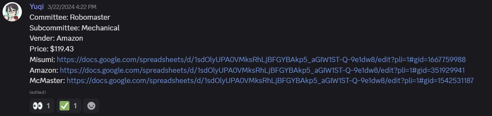
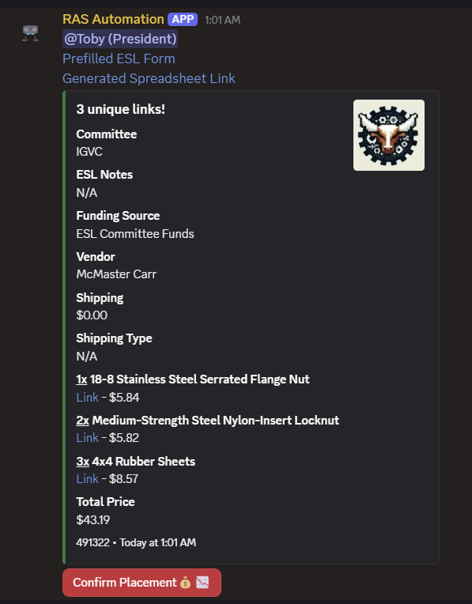

# RAS Orders Automation

TODO make this more readable and import more stuff from documentation in google docs https://docs.google.com/document/d/14fuzHv5QTbZqeqry1lfygl2T4PB1N2hq2_MsGoP_D9k/edit?tab=t.0

TODO make toc and section this readme into     what this is / how to use as front end user / how it works in back end / how to develop / todos

TODO refactor code to be better™️
  - modular file system good, but need to make modular functions to improve code reuse
    - i.e. propagation of message to another channel is very messy at the moment

Hello budget lover 🫵🥰 Please reach out to @tguyen in [UT IEEE RAS' Discord server](https://discord.gg/ehmhUTZ2NZ) for any questions :)

## Who does this benefit?
UT IEEE Robotics and Automation Society (UT RAS) students and any other UT students looking to streamline their organization's budgeting.
## What is this?
Automate paperwork for material/food procurement. This automation aims to remedy all the issues outlined below by reducing the amount of effort required to place, record, and track orders. 
## Why?
- Paperwork really sucks  
- UT Austin's Engineering Org Management's (Engineering Student Life (ESL)) requisition form is long, tedious, and requires compiling various information / spreadsheets for submission  
    - Mind numbing for people that have to submit the form over and over again, which is frequent for our org due to the nature of requiring many materials  
- There was no easy way to:
    - Keep content formatting consistent  
    - Read the order contents  
        - Which committee ordered this?  
        - What is actually in the order?  
        - Is the total order price correct?  
        - Does this order go over budget?  
        - How much does this order impact the budget?  
    - Track order state  
        - Has the order been placed?  
        - Has the order been received?  
    - Log orders in budget history properly
        - Is the order logged in the budget sheet?
        - Less than half of orders were logged, which led to overspending and unfair budget allocation  
    - Keep track of HCB (off-campus bank) vs ESL (on-campus bank) orders
- Previously, everyone was just dumping order requests into a discord channel  
- The treasurer then (sometimes) marked these plaintext messages with Discord reactions as seen below:



Here is what the front facing order system looks like now:


## How do I set this up?
These instructions assume you are setting up on a clean Linux environment (ran on Amazon Linux and Raspberry Pi OS)

Ensure system is at latest update and install git
```
sudo apt update && sudo apt
sudo apt install git
```

Clone and enter discord-bot repository
```
git clone https://github.com/tguyenn/ras-discord-bot.git
cd ras-discord-bot
```

Install Node.js
```
sudo apt install npm
```

Verify proper Node.js installation
```
node -v
```

Install requisite packages
```
npm install pm2@latest -g
npm install discord.js
```

Need to create /config/config.json file (todo: show sample)

Register process with PM2 and set it to start on device bootup
```
pm2 start index.js --name discord-bot
pm2 startup (follow instructions - copy paste given command)
pm2 save
```

---

# How does this system work?

This automated system is broken up into two parts:
1. **Google Apps Script (GAS)**  
   - Runs on Google Form (order form) submission  
   - Some functions run periodically (i.e. polling email inbox for package notifications from ESL) 
2. **Discord bot**  
   - Runs 24/7 on EC2 instance  
   - Listens for HTTP requests from GAS  
   - Takes user input in Discord to mark orders as placed in Google sheet budget  

## Detailed System overiew
1. Someone fills out Reusable Order and submits Google Form with appropriate answer  
2. Script parses Google Form answer and determines what to do  
   - If **Materials**  
     - Read from Materials tab  
     - If **Amazon**  
       - Generate ESL Form  
       - Generate Amazon Cart Filler Link  
     - If **not Amazon**  
       - Generate ESL Form  
       - Creates a new Google Sheet and places it in Non-Amazon Generated Spreadsheets  
   - If **Food**  
     - Read from Food Invoice tab  
     - Generate ESL Form  
     - Generate OOEF form and places it in Generated Occasional Expense Forms  
   - If **Config**  
     - Read new properties from config tab  
     - Update script properties (note: overwrites duplicates)  
     - Send all script properties to bot  
     - Restart bot  
     - Stop execution  
3. Script inserts data into Master Budget Sheet  
4. Script sends order data to Discord bot that runs on AWS EC2 instance, which then publishes it in orders channel  
5. Discord bot listens for order placement confirmation via button interaction in orders channel and moves corresponding order to processed-orders channel  
6. Discord bot sends request to GAS web app to mark corresponding order entries as placed  
7. Any order not placed by end of day (11PM) triggers a ping to appropriate officer in order-discussion channel  
8. Script running on a periodic time trigger scans the ut.ieee.ras@gmail.com email inbox for ESL package reception notifications and forwards notification to Discord orders-discussion channel via webhook  

---

# Accessing the Google Script

To access the Google Script code:
- Go to the Google Form and click the 3 vertical dots menu in the top right → **Script Editor**.  
- You will then see an IDE.  

If you hover over the left menu, you will see the following items:

- **Editor**  
  - IDE for writing scripts  

- **Triggers**  
  - Each trigger defines when a specified function executes  
  - The function trigger for the main script should be defined as follows:  

- **Executions**  
  - History log of all script executions (fail/complete)  
  - This is where `Logger.log()` messages show when you click on a particular execution  

- **Project Settings**  
  - Important for enabling access to `appsscript.json` from the Editor  
  - `appsscript.json` is crucial for script permission enabling  

---

# The Script Code

Most of the code is self explanatory, so this section will only touch on some necessities (most important being where to find specific pieces of data) and general tips  

## Overview
The Google Script Project is heavily based on the script in this repository:  
👉 https://github.com/Iku/Google-Forms-to-Discord  

Our version builds on this repository by adding features like…  
- Creating a new spreadsheet with Google Form content for individual non-Amazon orders  
- Generating a prefilled ESL form  
- Allows user input to be a spreadsheet instead of a million question form  
- Importing the data into our master budget sheet  
- Various customizations to the Discord embed (i.e. thumbnail, custom messages, embed color, auto-pinging, etc)  
- …and much more! Hooray 😀🥳🎉🎈  

## Important Tips
- Source control/version history is a huge pain by default because Apps Script doesn’t natively support git/easy source control  
    - 👉 https://github.com/google/clasp  
    - This lets you pull and push from your Apps Script workspace / local files  
    - I highly recommend you **ONLY pull from the Apps Script** workspace and push to GitHub from your local  
    - Pushing to Apps Scripts is dangerous because it irreversibly overwrites all the content there  
- Each `.gs` file represents a module in the system (i.e. `Discord.gs` has code for publishing data to Discord)  
    - Each file should have a single function at the top to be called by `Main.gs` (i.e. `ESLForm.gs` has `getESLForm()`)  
    - `Discord.gs` is only exception since it has another function (`killProcess()`) that should run when an error occurs  
- Make sure to SAVE before expecting changes in script behavior (`CTRL + S`)  
- `mainOnSubmit()` in `Main.gs` runs on form submission  
- `CTRL + R` is very useful for prototyping because you don’t have to submit the form to run your code  

---

# Creating/Editing/Reading Google Sheets
- There are a few permissions required to programmatically create, edit, and read Google Sheets  
- These permissions can be found in `appsscript.json`  
- View of this file is disabled by default, so you need to enable it in the settings as detailed in section above  
- After editing the permissions in `appsscript.json`, make sure to run (`CTRL+R`) your code and follow the popup dialog to refresh the permissions  

- `folderID` (in `CreateSheet.gs`’s `createSheet()`) specifies what folder to place the new sheet in  
  - Can be found at the end of a Google Drive URL  

- `sheetID` (in `EditMasterSheet.gs`’s `editMasterSheet()` function) specifies which Google Sheet to append data to and is retrieved from the Google Sheet URL  
  - `sheetID` is found between `/d/` and `/edit`.  

- `inputSheetID` (in `ReadInputSheet.gs`’s `readSheet()`) gets read by parsing the Google Form’s answer to the file upload question  

---


# TODO (priority ordered)
## Budget Sheet
- Fix grant tracking sheet formula in budget  
  - Currently breaks if a committee doesn’t have any grant purchases (i.e. not ESL or HCB) lol  

---

## Script
- Move clearing of reusable order sheet to very end of chain of actions so that it only gets cleared if everything processes successfully  
  - If stuff breaks (it does way too often), people have to fill out the reusable order sheet again or revert the version (sucks!)  

- Figure out how to transport discord bot token to discord bot securely (happens during config change)  
  - At the moment we are sending it over the internet in plaintext, which is very very bad lol  
  - Need to figure out how to encode → transmit → receive → decode the JSON config payload  

- Figure out a better way to handle internal vs external special notes  
  - **INTERNAL**: “this should come out of next year’s budget”  
  - **INTERNAL**: “this should use [grant that was deposited as liquid money into ESL bank]”  
  - **EXTERNAL**: “this should use Texas Robotics grant”  
  - Sucks bc each grant case is different  
  - Best way to do this would likely be to add a flag to the import funding source input range (see grant tracking tab in budget sheet)  

- Refactor Amazon order handling  
  - For context, Amazon splits up larger orders of items into smaller ones for different shipping dates (i think thats why?)  
  - Make the Amazon process button split up the initial order into the respective item groups for ease  
  - Add support for sales tax amount input  
    - Will be a reality since we are leaving ESL walled garden  
  - Add support for Amazon email notification in discord since ESL notifs don’t do shit  

---

## Discord bot
- Refactor code to not be shit  
  - Keep files much much shorter and modularize functionality 
  - Try to keep functions at around 30 lines if possible (use more helper functions to make the codebase maintainable lol)  

- Find free alternative hosting method  
  - AWS expensive, even with the t2.micro plan  

- Figure out security groups in AWS to ensure nobody on the internet does the funny with our bot  

- Time stamp the time and date of order placement when moving the order to placed orders  
  - Carry this data along when moving the order to received order  
  - At the moment this data just gets lost as the order moves through the channels (currently encoded in message send time, which gets clobbered when the order gets moved)  


- Make the order reception button send an http request to the GAS webapp to mark the checks for received orders  
  - Functionality for order placement works already, so just extend that  

- Make order bot ping relevant people in discussion channel on package reception  

- Containerize the application in Docker  
  - We could easily port our application over to another EC2 instance in case the current one explodes  
  - Would be good to understand why chatgpt said to use port 3000 because that is normally something for local development lmao  

- Modify edit-embed command to return error if bot has insufficient permissions to modify messages  
  - The bot currently returns a false completion message when it tries to modify an embed where it doesn’t have enough permissions (i.e. in welcome channel)  

- Figure out processed orders automation  
  - Notify committee heads once order arrives with click of button  
  - Would be easy if each order arrived in its entirety but nooo  

---

## Figure out how to deploy this kind of application to another org
- GAS source code in its current state must be hosted on their own google account due to nature of application  
- Hard part is that the automation consists of two apps (GAS and discord bot), so cant easily containerize the entire setup with Docker  
- This could be solved by running EVERYTHING through discord bot, but that requires authentication for accessing google drive/gmail content  

- Figure out how to deploy this application on university network via raspberry pi instead of AWS EC2 instance  
  - Running on my personal card right now lol  

---


# How to Use (front end)

1. Update the target budget spreadsheet (currently geared to handle the dual ESL/HCB banking setup in 2025-2026) in the `Master Config Table` of the [Reusable Order](https://docs.google.com/spreadsheets/d/1Ud5ZEs9mdV4Lk5InK7P9jcXaRlwkBsqSURoN1luDPls/edit?gid=829615052#gid=829615052) 
2. Update new funding sources in the `Grant Tracking` tab of the budget sheet as they come

Whenever you need to change anything (i.e. target budget sheet, target Discord channel, button text, etc.) in the automation, it is likely in the `Master Config Table` within the`Config` tab of [the Reusable Order sheet](https://docs.google.com/spreadsheets/d/1Ud5ZEs9mdV4Lk5InK7P9jcXaRlwkBsqSURoN1luDPls/edit?gid=0#gid=0). 
1. Save your changes in the sheet
2. Submit the [Order Request Google Form](https://docs.google.com/forms/d/e/1FAIpQLSe3QJqF6wh7JAJeEL2g7kjZqMlZMkWVZXZWiLN95qWjk69KAw/viewform?usp=header) with the `Update Config` option to propagate the changes.